# Fu-En Wang(102061149)
# Project3: Scene recognition with bag of words

## Introduction
In this project we will implement several system to recongnize what kind of scene in 1500 test images.

## Background Knowledge
### SIFT
Scale-invariant feature transform (SIFT) can detect the key point loacation and descriptor of an image. Because SIFT will calculate the orientation of patches, so it is commonly considered robust to view change of camera.

### Kmeans
When we has a set feature represetation and we want to divide then into K groups, we can simply use kmeans algorithm to do this.

### Support Vector Machine(SVM)
SVM is a common way to classify the category of data in machine learning. SVM will train the weight parameter according a binary label with 1 for true positive, -1 for true negative.

## Implementation

### Feature Representation
#### Tiny Image
<strong>Tiny Image</strong> is to resize the origin image to certain size(i.e 16 x 16) and horizontally vectorized it.
```
    image_feats = []; 
    for i = 1:length(image_paths)
        img = imread(image_paths{i});
        img_resize = imresize(img, [16, 16]);
        image_feats(end+1, :) = img_resize(:)';
    end 
```
#### Bag of SIFT
<strong>First</strong>, we need to extract the vocabulary in our train image sets. The method is to random sample SIFT features from each train images, for me I sample 256 features per image. And then we calculate kmeans of these features.
```
    sample_desc = []; 
    vocab = 0;
    sample_num = 1000;
    sample_image_index = randsample(1:length(image_paths), sample_num);
    for i = 1:length(sample_image_index)
        fprintf('Vocab:  %d', i)
        img = im2single(imread(image_paths{sample_image_index(i)}));
        [loc, feature] = vl_dsift(img, 'fast');
        %[loc, feature] = vl_sift(img);
        sample_index = randsample(1:size(loc,2), 256);
        sample_desc = [sample_desc feature(:, sample_index)];
    end 
    [vocab, assignments] = vl_kmeans(single(sample_desc), vocab_size);
```

<strong>Second</strong>, we will calculate the euclidean distance between feature in each test images and the vocabulary. For each test image, we will match each feature to a group which is the index of the shortest distance. As a result, we will get a histogram based on our vocabulary. And the histogram is the feature vector of an image.  
```
    load('vocab.mat');
    vocab_size = size(vocab, 2); 
    image_feats = zeros([length(image_paths) vocab_size]);
    for i = 1:length(image_paths)
        fprintf('bag:   %d', i)
        img = single(imread(image_paths{i}));
        [loc, desc] = vl_dsift(img, 'step', 5, 'fast');
        D = vl_alldist2(single(desc), vocab);
        [~, min_idx_map] = min(D, [], 2); 
        for j = 1:vocab_size
            image_feats(i, j) = sum(min_idx_map == j); 
        end
    end 
```

### Classifier
#### Nearest Neighbor
Nearest Neighbor is simply calculate the euclidean distance between train image and  test image features and choose the category which the closest one belong to.
```
    predicted_categories = {}; 
    D = vl_alldist2(test_image_feats', train_image_feats');
    [~, min_index_map] = min(D, [], 2); 
    size(min_index_map)
    max(min_index_map)
    for i=1:size(test_image_feats, 1)
        predicted_categories{end+1} = train_labels{min_index_map(i)};
    end 
    predicted_categories = predicted_categories'
```
#### Support Vector Machine(SVM)
We can use SVM to train the weight for each category to obtain the 1 vs all model. And we can simply use this model to weight test image feature and the category which the one has highest score belong to.
```
    categories = unique(train_labels); 
    num_categories = length(categories);
    train_feat = train_image_feats';
    test_feat = test_image_feats';
    W_mat = [];
    B_lst = [];
    %%%%
    LAMBDA = 0.01;
    diag_freq = 100;
    maxIter = 1E5;
    SVMeps = 1E-5;
    %%%%
    for i = 1:length(categories)
        categories{i}
        indice = strcmp(categories{i}, train_labels);
        binary = zeros([1 length(train_labels)]) - 1;
        binary(indice) = 1;
        %binary
        %error('GG')
        %binary(~binary) = -1;
        [W B] = vl_svmtrain( train_feat, binary, LAMBDA, 'MaxNumIterations', maxIter, ...
                            'Epsilon',SVMeps);
        W_mat(end+1, :) = W;
        B_lst(end+1) = B;
    end
    B_mat = [];
    for i=1:size(test_feat,2)
        B_mat = [B_mat B_lst'];
    end
    score = W_mat * test_feat + B_mat;
    [~, max_index] = max(score, [], 1);
    predicted_categories = {};
    for i = 1:size(test_feat,2)
        predicted_categories{end+1} = categories{max_index(i)};
    end
    predicted_categories = predicted_categories';
```
## Result
### Tiny Image and Nearest Neighbor
<center>


<br>
Accuracy (mean of diagonal of confusion matrix) is 0.191
<p>

<table border=0 cellpadding=4 cellspacing=1>
<tr>
<th>Category name</th>
<th>Accuracy</th>
<th colspan=2>Sample training images</th>
<th colspan=2>Sample true positives</th>
<th colspan=2>False positives with true label</th>
<th colspan=2>False negatives with wrong predicted label</th>
</tr>
<tr>
<td>Kitchen</td>
<td>0.050</td>
<td bgcolor=LightBlue></td>
<td bgcolor=LightBlue></td>
<td bgcolor=LightGreen></td>
<td bgcolor=LightGreen>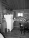</td>
<td bgcolor=LightCoral><br><small>InsideCity</small></td>
<td bgcolor=LightCoral><br><small>Industrial</small></td>
<td bgcolor=#FFBB55><br><small>Kitchen</small></td>
<td bgcolor=#FFBB55><br><small>Kitchen</small></td>
</tr>
<tr>
<td>Store</td>
<td>0.020</td>
<td bgcolor=LightBlue></td>
<td bgcolor=LightBlue></td>
<td bgcolor=LightGreen></td>
<td bgcolor=LightGreen></td>
<td bgcolor=LightCoral><br><small>Bedroom</small></td>
<td bgcolor=LightCoral><br><small>Bedroom</small></td>
<td bgcolor=#FFBB55><br><small>Store</small></td>
<td bgcolor=#FFBB55><br><small>Store</small></td>
</tr>
<tr>
<td>Bedroom</td>
<td>0.080</td>
<td bgcolor=LightBlue></td>
<td bgcolor=LightBlue></td>
<td bgcolor=LightGreen></td>
<td bgcolor=LightGreen></td>
<td bgcolor=LightCoral><br><small>Mountain</small></td>
<td bgcolor=LightCoral><br><small>InsideCity</small></td>
<td bgcolor=#FFBB55>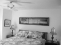<br><small>Bedroom</small></td>
<td bgcolor=#FFBB55><br><small>Bedroom</small></td>
</tr>
<tr>
<td>LivingRoom</td>
<td>0.080</td>
<td bgcolor=LightBlue></td>
<td bgcolor=LightBlue></td>
<td bgcolor=LightGreen></td>
<td bgcolor=LightGreen></td>
<td bgcolor=LightCoral><br><small>Office</small></td>
<td bgcolor=LightCoral><br><small>Bedroom</small></td>
<td bgcolor=#FFBB55><br><small>LivingRoom</small></td>
<td bgcolor=#FFBB55><br><small>LivingRoom</small></td>
</tr>
<tr>
<td>Office</td>
<td>0.050</td>
<td bgcolor=LightBlue></td>
<td bgcolor=LightBlue></td>
<td bgcolor=LightGreen></td>
<td bgcolor=LightGreen></td>
<td bgcolor=LightCoral><br><small>Coast</small></td>
<td bgcolor=LightCoral><br><small>Kitchen</small></td>
<td bgcolor=#FFBB55><br><small>Office</small></td>
<td bgcolor=#FFBB55><br><small>Office</small></td>
</tr>
<tr>
<td>Industrial</td>
<td>0.020</td>
<td bgcolor=LightBlue></td>
<td bgcolor=LightBlue></td>
<td bgcolor=LightGreen></td>
<td bgcolor=LightGreen></td>
<td bgcolor=LightCoral><br><small>Mountain</small></td>
<td bgcolor=LightCoral><br><small>Street</small></td>
<td bgcolor=#FFBB55><br><small>Industrial</small></td>
<td bgcolor=#FFBB55><br><small>Industrial</small></td>
</tr>
<tr>
<td>Suburb</td>
<td>0.210</td>
<td bgcolor=LightBlue></td>
<td bgcolor=LightBlue></td>
<td bgcolor=LightGreen></td>
<td bgcolor=LightGreen></td>
<td bgcolor=LightCoral><br><small>Store</small></td>
<td bgcolor=LightCoral></td>
<td bgcolor=#FFBB55>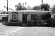<br><small>Suburb</small></td>
<td bgcolor=#FFBB55><br><small>Suburb</small></td>
</tr>
<tr>
<td>InsideCity</td>
<td>0.100</td>
<td bgcolor=LightBlue></td>
<td bgcolor=LightBlue></td>
<td bgcolor=LightGreen></td>
<td bgcolor=LightGreen></td>
<td bgcolor=LightCoral><br><small>Mountain</small></td>
<td bgcolor=LightCoral><br><small>OpenCountry</small></td>
<td bgcolor=#FFBB55><br><small>InsideCity</small></td>
<td bgcolor=#FFBB55><br><small>InsideCity</small></td>
</tr>
<tr>
<td>TallBuilding</td>
<td>0.110</td>
<td bgcolor=LightBlue></td>
<td bgcolor=LightBlue></td>
<td bgcolor=LightGreen></td>
<td bgcolor=LightGreen></td>
<td bgcolor=LightCoral><br><small>InsideCity</small></td>
<td bgcolor=LightCoral><br><small>Office</small></td>
<td bgcolor=#FFBB55><br><small>TallBuilding</small></td>
<td bgcolor=#FFBB55><br><small>TallBuilding</small></td>
</tr>
<tr>
<td>Street</td>
<td>0.400</td>
<td bgcolor=LightBlue></td>
<td bgcolor=LightBlue></td>
<td bgcolor=LightGreen></td>
<td bgcolor=LightGreen></td>
<td bgcolor=LightCoral><br><small>Suburb</small></td>
<td bgcolor=LightCoral><br><small>Suburb</small></td>
<td bgcolor=#FFBB55><br><small>Street</small></td>
<td bgcolor=#FFBB55><br><small>Street</small></td>
</tr>
<tr>
<td>Highway</td>
<td>0.690</td>
<td bgcolor=LightBlue></td>
<td bgcolor=LightBlue></td>
<td bgcolor=LightGreen></td>
<td bgcolor=LightGreen></td>
<td bgcolor=LightCoral><br><small>Suburb</small></td>
<td bgcolor=LightCoral><br><small>Forest</small></td>
<td bgcolor=#FFBB55><br><small>Highway</small></td>
<td bgcolor=#FFBB55><br><small>Highway</small></td>
</tr>
<tr>
<td>OpenCountry</td>
<td>0.310</td>
<td bgcolor=LightBlue></td>
<td bgcolor=LightBlue></td>
<td bgcolor=LightGreen></td>
<td bgcolor=LightGreen></td>
<td bgcolor=LightCoral><br><small>Office</small></td>
<td bgcolor=LightCoral><br><small>Store</small></td>
<td bgcolor=#FFBB55><br><small>OpenCountry</small></td>
<td bgcolor=#FFBB55>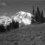<br><small>OpenCountry</small></td>
</tr>
<tr>
<td>Coast</td>
<td>0.280</td>
<td bgcolor=LightBlue></td>
<td bgcolor=LightBlue></td>
<td bgcolor=LightGreen>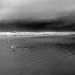</td>
<td bgcolor=LightGreen></td>
<td bgcolor=LightCoral><br><small>Highway</small></td>
<td bgcolor=LightCoral><br><small>Bedroom</small></td>
<td bgcolor=#FFBB55><br><small>Coast</small></td>
<td bgcolor=#FFBB55><br><small>Coast</small></td>
</tr>
<tr>
<td>Mountain</td>
<td>0.130</td>
<td bgcolor=LightBlue></td>
<td bgcolor=LightBlue></td>
<td bgcolor=LightGreen></td>
<td bgcolor=LightGreen></td>
<td bgcolor=LightCoral><br><small>Suburb</small></td>
<td bgcolor=LightCoral><br><small>OpenCountry</small></td>
<td bgcolor=#FFBB55><br><small>Mountain</small></td>
<td bgcolor=#FFBB55><br><small>Mountain</small></td>
</tr>
<tr>
<td>Forest</td>
<td>0.340</td>
<td bgcolor=LightBlue></td>
<td bgcolor=LightBlue></td>
<td bgcolor=LightGreen></td>
<td bgcolor=LightGreen></td>
<td bgcolor=LightCoral><br><small>InsideCity</small></td>
<td bgcolor=LightCoral><br><small>Highway</small></td>
<td bgcolor=#FFBB55><br><small>Forest</small></td>
<td bgcolor=#FFBB55><br><small>Forest</small></td>
</tr>
<tr>
<th>Category name</th>
<th>Accuracy</th>
<th colspan=2>Sample training images</th>
<th colspan=2>Sample true positives</th>
<th colspan=2>False positives with true label</th>
<th colspan=2>False negatives with wrong predicted label</th>
</tr>
</table>
</center>

### Bag of SIFT and Nearest Neighbor
<center>


<br>
Accuracy (mean of diagonal of confusion matrix) is 0.523
<p>

<table border=0 cellpadding=4 cellspacing=1>
<tr>
<th>Category name</th>
<th>Accuracy</th>
<th colspan=2>Sample training images</th>
<th colspan=2>Sample true positives</th>
<th colspan=2>False positives with true label</th>
<th colspan=2>False negatives with wrong predicted label</th>
</tr>
<tr>
<td>Kitchen</td>
<td>0.430</td>
<td bgcolor=LightBlue></td>
<td bgcolor=LightBlue></td>
<td bgcolor=LightGreen></td>
<td bgcolor=LightGreen></td>
<td bgcolor=LightCoral><br><small>Bedroom</small></td>
<td bgcolor=LightCoral><br><small>Bedroom</small></td>
<td bgcolor=#FFBB55><br><small>Kitchen</small></td>
<td bgcolor=#FFBB55><br><small>Kitchen</small></td>
</tr>
<tr>
<td>Store</td>
<td>0.550</td>
<td bgcolor=LightBlue></td>
<td bgcolor=LightBlue></td>
<td bgcolor=LightGreen></td>
<td bgcolor=LightGreen></td>
<td bgcolor=LightCoral><br><small>Coast</small></td>
<td bgcolor=LightCoral><br><small>Industrial</small></td>
<td bgcolor=#FFBB55><br><small>Store</small></td>
<td bgcolor=#FFBB55><br><small>Store</small></td>
</tr>
<tr>
<td>Bedroom</td>
<td>0.410</td>
<td bgcolor=LightBlue></td>
<td bgcolor=LightBlue></td>
<td bgcolor=LightGreen></td>
<td bgcolor=LightGreen></td>
<td bgcolor=LightCoral><br><small>Highway</small></td>
<td bgcolor=LightCoral><br><small>LivingRoom</small></td>
<td bgcolor=#FFBB55><br><small>Bedroom</small></td>
<td bgcolor=#FFBB55><br><small>Bedroom</small></td>
</tr>
<tr>
<td>LivingRoom</td>
<td>0.340</td>
<td bgcolor=LightBlue></td>
<td bgcolor=LightBlue></td>
<td bgcolor=LightGreen></td>
<td bgcolor=LightGreen></td>
<td bgcolor=LightCoral><br><small>Kitchen</small></td>
<td bgcolor=LightCoral><br><small>TallBuilding</small></td>
<td bgcolor=#FFBB55><br><small>LivingRoom</small></td>
<td bgcolor=#FFBB55><br><small>LivingRoom</small></td>
</tr>
<tr>
<td>Office</td>
<td>0.660</td>
<td bgcolor=LightBlue>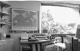</td>
<td bgcolor=LightBlue></td>
<td bgcolor=LightGreen></td>
<td bgcolor=LightGreen></td>
<td bgcolor=LightCoral>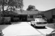<br><small>Suburb</small></td>
<td bgcolor=LightCoral><br><small>Kitchen</small></td>
<td bgcolor=#FFBB55><br><small>Office</small></td>
<td bgcolor=#FFBB55><br><small>Office</small></td>
</tr>
<tr>
<td>Industrial</td>
<td>0.300</td>
<td bgcolor=LightBlue></td>
<td bgcolor=LightBlue></td>
<td bgcolor=LightGreen></td>
<td bgcolor=LightGreen></td>
<td bgcolor=LightCoral><br><small>TallBuilding</small></td>
<td bgcolor=LightCoral><br><small>Street</small></td>
<td bgcolor=#FFBB55><br><small>Industrial</small></td>
<td bgcolor=#FFBB55><br><small>Industrial</small></td>
</tr>
<tr>
<td>Suburb</td>
<td>0.770</td>
<td bgcolor=LightBlue></td>
<td bgcolor=LightBlue></td>
<td bgcolor=LightGreen></td>
<td bgcolor=LightGreen></td>
<td bgcolor=LightCoral><br><small>Forest</small></td>
<td bgcolor=LightCoral><br><small>Mountain</small></td>
<td bgcolor=#FFBB55><br><small>Suburb</small></td>
<td bgcolor=#FFBB55><br><small>Suburb</small></td>
</tr>
<tr>
<td>InsideCity</td>
<td>0.380</td>
<td bgcolor=LightBlue></td>
<td bgcolor=LightBlue></td>
<td bgcolor=LightGreen></td>
<td bgcolor=LightGreen></td>
<td bgcolor=LightCoral><br><small>Street</small></td>
<td bgcolor=LightCoral><br><small>TallBuilding</small></td>
<td bgcolor=#FFBB55><br><small>InsideCity</small></td>
<td bgcolor=#FFBB55><br><small>InsideCity</small></td>
</tr>
<tr>
<td>TallBuilding</td>
<td>0.300</td>
<td bgcolor=LightBlue></td>
<td bgcolor=LightBlue></td>
<td bgcolor=LightGreen></td>
<td bgcolor=LightGreen></td>
<td bgcolor=LightCoral><br><small>InsideCity</small></td>
<td bgcolor=LightCoral><br><small>Mountain</small></td>
<td bgcolor=#FFBB55><br><small>TallBuilding</small></td>
<td bgcolor=#FFBB55><br><small>TallBuilding</small></td>
</tr>
<tr>
<td>Street</td>
<td>0.560</td>
<td bgcolor=LightBlue></td>
<td bgcolor=LightBlue></td>
<td bgcolor=LightGreen></td>
<td bgcolor=LightGreen></td>
<td bgcolor=LightCoral><br><small>TallBuilding</small></td>
<td bgcolor=LightCoral><br><small>InsideCity</small></td>
<td bgcolor=#FFBB55><br><small>Street</small></td>
<td bgcolor=#FFBB55><br><small>Street</small></td>
</tr>
<tr>
<td>Highway</td>
<td>0.790</td>
<td bgcolor=LightBlue></td>
<td bgcolor=LightBlue></td>
<td bgcolor=LightGreen></td>
<td bgcolor=LightGreen></td>
<td bgcolor=LightCoral><br><small>Mountain</small></td>
<td bgcolor=LightCoral><br><small>Industrial</small></td>
<td bgcolor=#FFBB55><br><small>Highway</small></td>
<td bgcolor=#FFBB55><br><small>Highway</small></td>
</tr>
<tr>
<td>OpenCountry</td>
<td>0.470</td>
<td bgcolor=LightBlue></td>
<td bgcolor=LightBlue></td>
<td bgcolor=LightGreen></td>
<td bgcolor=LightGreen></td>
<td bgcolor=LightCoral><br><small>Mountain</small></td>
<td bgcolor=LightCoral><br><small>Coast</small></td>
<td bgcolor=#FFBB55><br><small>OpenCountry</small></td>
<td bgcolor=#FFBB55><br><small>OpenCountry</small></td>
</tr>
<tr>
<td>Coast</td>
<td>0.420</td>
<td bgcolor=LightBlue></td>
<td bgcolor=LightBlue></td>
<td bgcolor=LightGreen></td>
<td bgcolor=LightGreen></td>
<td bgcolor=LightCoral><br><small>Mountain</small></td>
<td bgcolor=LightCoral><br><small>OpenCountry</small></td>
<td bgcolor=#FFBB55><br><small>Coast</small></td>
<td bgcolor=#FFBB55><br><small>Coast</small></td>
</tr>
<tr>
<td>Mountain</td>
<td>0.560</td>
<td bgcolor=LightBlue></td>
<td bgcolor=LightBlue></td>
<td bgcolor=LightGreen></td>
<td bgcolor=LightGreen></td>
<td bgcolor=LightCoral>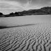<br><small>OpenCountry</small></td>
<td bgcolor=LightCoral><br><small>Coast</small></td>
<td bgcolor=#FFBB55><br><small>Mountain</small></td>
<td bgcolor=#FFBB55><br><small>Mountain</small></td>
</tr>
<tr>
<td>Forest</td>
<td>0.910</td>
<td bgcolor=LightBlue></td>
<td bgcolor=LightBlue></td>
<td bgcolor=LightGreen></td>
<td bgcolor=LightGreen></td>
<td bgcolor=LightCoral><br><small>Industrial</small></td>
<td bgcolor=LightCoral><br><small>Mountain</small></td>
<td bgcolor=#FFBB55><br><small>Forest</small></td>
<td bgcolor=#FFBB55><br><small>Forest</small></td>
</tr>
<tr>
<th>Category name</th>
<th>Accuracy</th>
<th colspan=2>Sample training images</th>
<th colspan=2>Sample true positives</th>
<th colspan=2>False positives with true label</th>
<th colspan=2>False negatives with wrong predicted label</th>
</tr>
</table>
</center>

### Bag of SIFT and SVM
<center>


<br>
Accuracy (mean of diagonal of confusion matrix) is 0.693
<p>

<table border=0 cellpadding=4 cellspacing=1>
<tr>
<th>Category name</th>
<th>Accuracy</th>
<th colspan=2>Sample training images</th>
<th colspan=2>Sample true positives</th>
<th colspan=2>False positives with true label</th>
<th colspan=2>False negatives with wrong predicted label</th>
</tr>
<tr>
<td>Kitchen</td>
<td>0.650</td>
<td bgcolor=LightBlue></td>
<td bgcolor=LightBlue></td>
<td bgcolor=LightGreen></td>
<td bgcolor=LightGreen></td>
<td bgcolor=LightCoral><br><small>Office</small></td>
<td bgcolor=LightCoral><br><small>LivingRoom</small></td>
<td bgcolor=#FFBB55><br><small>Kitchen</small></td>
<td bgcolor=#FFBB55><br><small>Kitchen</small></td>
</tr>
<tr>
<td>Store</td>
<td>0.600</td>
<td bgcolor=LightBlue></td>
<td bgcolor=LightBlue></td>
<td bgcolor=LightGreen></td>
<td bgcolor=LightGreen></td>
<td bgcolor=LightCoral><br><small>InsideCity</small></td>
<td bgcolor=LightCoral><br><small>Street</small></td>
<td bgcolor=#FFBB55><br><small>Store</small></td>
<td bgcolor=#FFBB55><br><small>Store</small></td>
</tr>
<tr>
<td>Bedroom</td>
<td>0.360</td>
<td bgcolor=LightBlue>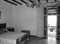</td>
<td bgcolor=LightBlue></td>
<td bgcolor=LightGreen></td>
<td bgcolor=LightGreen></td>
<td bgcolor=LightCoral><br><small>Kitchen</small></td>
<td bgcolor=LightCoral><br><small>LivingRoom</small></td>
<td bgcolor=#FFBB55><br><small>Bedroom</small></td>
<td bgcolor=#FFBB55><br><small>Bedroom</small></td>
</tr>
<tr>
<td>LivingRoom</td>
<td>0.320</td>
<td bgcolor=LightBlue></td>
<td bgcolor=LightBlue></td>
<td bgcolor=LightGreen>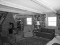</td>
<td bgcolor=LightGreen></td>
<td bgcolor=LightCoral><br><small>Street</small></td>
<td bgcolor=LightCoral><br><small>Bedroom</small></td>
<td bgcolor=#FFBB55>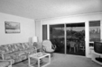<br><small>LivingRoom</small></td>
<td bgcolor=#FFBB55><br><small>LivingRoom</small></td>
</tr>
<tr>
<td>Office</td>
<td>0.980</td>
<td bgcolor=LightBlue></td>
<td bgcolor=LightBlue></td>
<td bgcolor=LightGreen></td>
<td bgcolor=LightGreen></td>
<td bgcolor=LightCoral><br><small>InsideCity</small></td>
<td bgcolor=LightCoral><br><small>LivingRoom</small></td>
<td bgcolor=#FFBB55><br><small>Office</small></td>
<td bgcolor=#FFBB55><br><small>Office</small></td>
</tr>
<tr>
<td>Industrial</td>
<td>0.540</td>
<td bgcolor=LightBlue></td>
<td bgcolor=LightBlue></td>
<td bgcolor=LightGreen></td>
<td bgcolor=LightGreen></td>
<td bgcolor=LightCoral><br><small>Kitchen</small></td>
<td bgcolor=LightCoral><br><small>TallBuilding</small></td>
<td bgcolor=#FFBB55><br><small>Industrial</small></td>
<td bgcolor=#FFBB55><br><small>Industrial</small></td>
</tr>
<tr>
<td>Suburb</td>
<td>0.980</td>
<td bgcolor=LightBlue></td>
<td bgcolor=LightBlue></td>
<td bgcolor=LightGreen></td>
<td bgcolor=LightGreen></td>
<td bgcolor=LightCoral><br><small>Industrial</small></td>
<td bgcolor=LightCoral>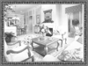<br><small>LivingRoom</small></td>
<td bgcolor=#FFBB55><br><small>Suburb</small></td>
<td bgcolor=#FFBB55><br><small>Suburb</small></td>
</tr>
<tr>
<td>InsideCity</td>
<td>0.640</td>
<td bgcolor=LightBlue></td>
<td bgcolor=LightBlue></td>
<td bgcolor=LightGreen></td>
<td bgcolor=LightGreen></td>
<td bgcolor=LightCoral><br><small>Industrial</small></td>
<td bgcolor=LightCoral><br><small>Industrial</small></td>
<td bgcolor=#FFBB55><br><small>InsideCity</small></td>
<td bgcolor=#FFBB55><br><small>InsideCity</small></td>
</tr>
<tr>
<td>TallBuilding</td>
<td>0.770</td>
<td bgcolor=LightBlue></td>
<td bgcolor=LightBlue></td>
<td bgcolor=LightGreen></td>
<td bgcolor=LightGreen></td>
<td bgcolor=LightCoral><br><small>Store</small></td>
<td bgcolor=LightCoral><br><small>Street</small></td>
<td bgcolor=#FFBB55>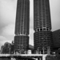<br><small>TallBuilding</small></td>
<td bgcolor=#FFBB55><br><small>TallBuilding</small></td>
</tr>
<tr>
<td>Street</td>
<td>0.620</td>
<td bgcolor=LightBlue></td>
<td bgcolor=LightBlue></td>
<td bgcolor=LightGreen></td>
<td bgcolor=LightGreen></td>
<td bgcolor=LightCoral><br><small>Forest</small></td>
<td bgcolor=LightCoral><br><small>InsideCity</small></td>
<td bgcolor=#FFBB55>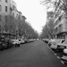<br><small>Street</small></td>
<td bgcolor=#FFBB55><br><small>Street</small></td>
</tr>
<tr>
<td>Highway</td>
<td>0.830</td>
<td bgcolor=LightBlue></td>
<td bgcolor=LightBlue></td>
<td bgcolor=LightGreen></td>
<td bgcolor=LightGreen></td>
<td bgcolor=LightCoral><br><small>Street</small></td>
<td bgcolor=LightCoral><br><small>Coast</small></td>
<td bgcolor=#FFBB55><br><small>Highway</small></td>
<td bgcolor=#FFBB55><br><small>Highway</small></td>
</tr>
<tr>
<td>OpenCountry</td>
<td>0.510</td>
<td bgcolor=LightBlue></td>
<td bgcolor=LightBlue></td>
<td bgcolor=LightGreen></td>
<td bgcolor=LightGreen></td>
<td bgcolor=LightCoral><br><small>Coast</small></td>
<td bgcolor=LightCoral><br><small>Highway</small></td>
<td bgcolor=#FFBB55><br><small>OpenCountry</small></td>
<td bgcolor=#FFBB55><br><small>OpenCountry</small></td>
</tr>
<tr>
<td>Coast</td>
<td>0.810</td>
<td bgcolor=LightBlue></td>
<td bgcolor=LightBlue></td>
<td bgcolor=LightGreen></td>
<td bgcolor=LightGreen>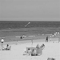</td>
<td bgcolor=LightCoral><br><small>OpenCountry</small></td>
<td bgcolor=LightCoral><br><small>OpenCountry</small></td>
<td bgcolor=#FFBB55><br><small>Coast</small></td>
<td bgcolor=#FFBB55><br><small>Coast</small></td>
</tr>
<tr>
<td>Mountain</td>
<td>0.840</td>
<td bgcolor=LightBlue></td>
<td bgcolor=LightBlue></td>
<td bgcolor=LightGreen></td>
<td bgcolor=LightGreen></td>
<td bgcolor=LightCoral><br><small>Forest</small></td>
<td bgcolor=LightCoral><br><small>Street</small></td>
<td bgcolor=#FFBB55><br><small>Mountain</small></td>
<td bgcolor=#FFBB55><br><small>Mountain</small></td>
</tr>
<tr>
<td>Forest</td>
<td>0.940</td>
<td bgcolor=LightBlue>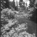</td>
<td bgcolor=LightBlue></td>
<td bgcolor=LightGreen></td>
<td bgcolor=LightGreen></td>
<td bgcolor=LightCoral><br><small>Highway</small></td>
<td bgcolor=LightCoral>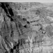<br><small>Mountain</small></td>
<td bgcolor=#FFBB55><br><small>Forest</small></td>
<td bgcolor=#FFBB55><br><small>Forest</small></td>
</tr>
<tr>
<th>Category name</th>
<th>Accuracy</th>
<th colspan=2>Sample training images</th>
<th colspan=2>Sample true positives</th>
<th colspan=2>False positives with true label</th>
<th colspan=2>False negatives with wrong predicted label</th>
</tr>
</table>
</center>


